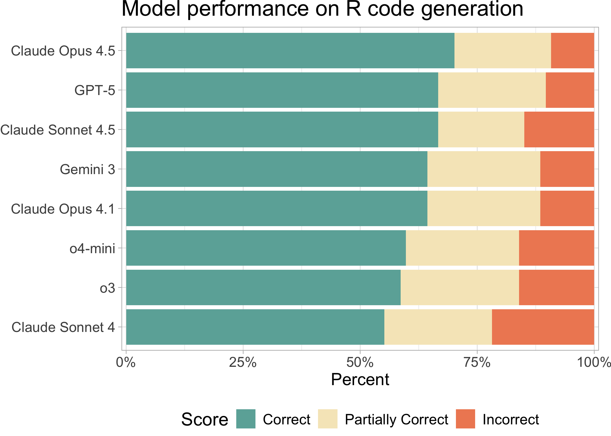
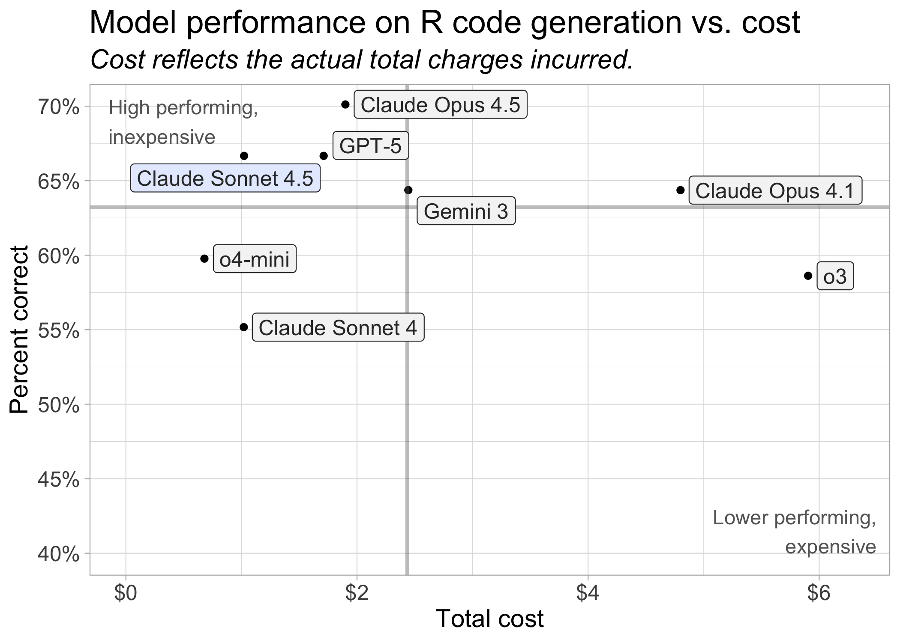

# Which AI model writes the best R code?
Sara Altman, Simon Couch

**LLMs can now help you write R code. There are many available models,
so which one should you pick?**

We evaluated how well various models generate R code. To do so, we used
the [vitals package](https://vitals.tidyverse.org/), a framework for LLM
evaluation. vitals contains functions for measuring the effectiveness of
an LLM, as well as a dataset of challenging R coding problems and their
solutions. We evaluated model performance on this set of coding
problems.

In June, we ran an earlier version of this evaluation with the models
available at the time. You can read that blog post
[here](https://posit.co/blog/r-llm-evaluation/). If you’re interested in
Python code generation, we also evaluated how well various models
perform on [Pandas code
generation](https://posit.co/blog/python-llm-evaluation/).

## Current recommendation: OpenAI GPT-5, OpenAI o4-mini, or Claude Sonnet 4

**For R coding tasks, we recommend using OpenAI’s GPT-5 or o4-mini or
Claude Sonnet 4.** OpenAI’s o3 also scored well, but its cost was
roughly ten times higher than o4-mini and about four times higher than
GPT-5. Claude Sonnet 4 remains a competitive option for R code
generation. Anecdotally, many R programmers seem to prefer Claude Sonnet
to OpenAI’s models.

> [!NOTE]
>
> ### Reasoning vs. non-reasoning models
>
> *Thinking* or *reasoning* models are LLMs that attempt to solve tasks
> through structured, step-by-step processing rather than just
> pattern-matching.
>
> Most of the models we looked at here are reasoning models, or are
> capable of reasoning. The only models not designed for reasoning are
> GPT-4.1 and Claude Sonnet 4 with thinking disabled. The gpt-oss models
> can perform reasoning, but lack a dedicated reasoning mode.

> [!CAUTION]
>
> ### Take token usage into account
>
> A **token** is the fundamental unit of data that an LLM can process
> (for text processing, a token is approximately a word). Different
> models use different amounts of tokens, and reasoning models typically
> generate significantly more output tokens than non-reasoning models.
> As a result, a model that is inexpensive on a per-token basis can, in
> practice, cost much more if it produces longer outputs.
>
> In our evaluation, however, the models that generated the most tokens
> (GPT-5, GPT-5 nano, and o4-mini) were still among the least expensive
> overall.

## Key insights

- **OpenAI’s GPT-5, o4-mini, and o3 are the current best performers on
  the set of R coding tasks.**

  The GPT-5 family of models (released August 2025) are the newest
  models evaluated.

- **OpenAI’s newer models performed much better than its older models,
  GPT-4.1, o1, and o3-mini.**

- **Claude Sonnet 4 remains a reliable choice for R code generation**.
  On this evaluation, Claude Sonnet 4 performed slightly better with
  thinking enabled.

## What about the open source models?

OpenAI recently released two open-weight models, gpt-oss-120b and
gpt-oss-20b, which can be run locally or deployed on a platform like
Hugging Face.

If you already work with open-weight models or have a specific reason to
do so, these models, especially gpt-oss-120b, may be worth exploring.
However, if your primary criterion is performance, they are unlikely to
be the best choice compared to the top paid models.

Also, although open-weight models are technically free to use, you may
still need to host them somewhere, which can incur significant costs.

## Pricing

LLM pricing is typically provided per million tokens. In our evaluation
process, each model used between 26,070 and 31,720 input tokens and
between 42,320 and 289,000 output tokens. The entire analysis cost
around \$24.

As noted above, although the gpt-oss models are free to use, you may
need to pay to host them if you are unable to run them locally.

| Model costs, in order of eval performance |  |  |  |  |  |
|----|----|----|----|----|----|
| Input and Output costs are per 1 million tokens. 'Actual cost' reflects total charges for running the evaluation. |  |  |  |  |  |
| Name | Input | Output | Actual cost | Input tokens used | Output tokens used |
| Claude Sonnet 4.5 | \$3.00 | \$15.00 | \$1.02 | 31,314 | 61,936 |
| GPT-5 | \$1.25 | \$10.00 | \$1.71 | 26,067 | 167,873 |
| Claude Opus 4.1 | \$15.00 | \$75.00 | NA | NA | NA |
| o4-mini | \$1.10 | \$4.40 | \$0.68 | 26,067 | 147,862 |
| o3 | \$10.00 | \$40.00 | \$5.90 | 26,067 | 141,099 |
| Claude Sonnet 4 (No Thinking) | \$3.00 | \$15.00 | \$0.72 | 28,878 | 42,315 |
| Claude Sonnet 4 (Thinking) | \$3.00 | \$15.00 | \$1.02 | 31,314 | 61,704 |
| GPT-5 mini | \$0.25 | \$2.00 | \$0.22 | 26,067 | 108,853 |
| gpt-oss-120b | \$0.00 | \$0.00 | \$0.00 | 31,722 | 116,514 |
| GPT-5 nano | \$0.05 | \$0.40 | \$0.12 | 26,067 | 289,016 |
| o1 | \$15.00 | \$60.00 | \$7.44 | 26,067 | 117,445 |
| GPT-4.1 | \$2.00 | \$8.00 | \$0.43 | 26,154 | 47,351 |
| gpt-oss-20b | \$0.00 | \$0.00 | \$0.00 | 31,722 | 133,522 |
| o3-mini | \$1.10 | \$4.40 | \$0.42 | 26,067 | 88,420 |

## Methodology

- We used [ellmer](https://ellmer.tidyverse.org/) to create connections
  to the various models and [vitals](https://vitals.tidyverse.org/) to
  evaluate model performance on R code generation tasks.
- We tested each model on a shared benchmark: the `are` dataset (“**A**n
  **R** **E**val”). `are` contains a collection of difficult R coding
  problems and a column, `target`, with information about the target
  solution.  
- Using vitals, we had each model solve each problem in `are`. Then, we
  scored their solutions using a scoring model (Claude 3.7 Sonnet). Each
  solution received either an Incorrect, Partially Correct, or Correct
  score.

You can see all the code used to evaluate the models
[here](https://github.com/skaltman/model-eval-r/blob/99b405a40b6b5f12ed03eba6d1f6d3d20620cd84/eval.R).
If you’d like to see a more in-depth analysis, check out Simon Couch’s
series of [blog posts](https://www.simonpcouch.com/blog/), which this
post is based on, including [Claude 4 and R
Coding](https://www.simonpcouch.com/blog/2025-05-27-claude-4/).
